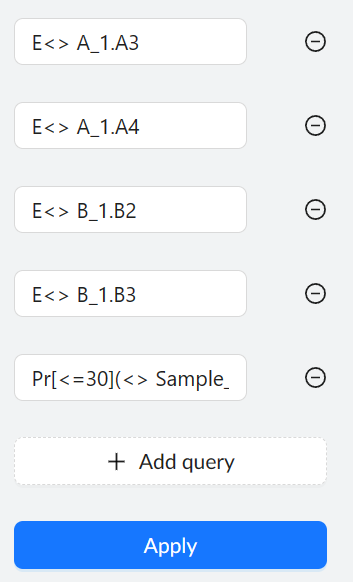
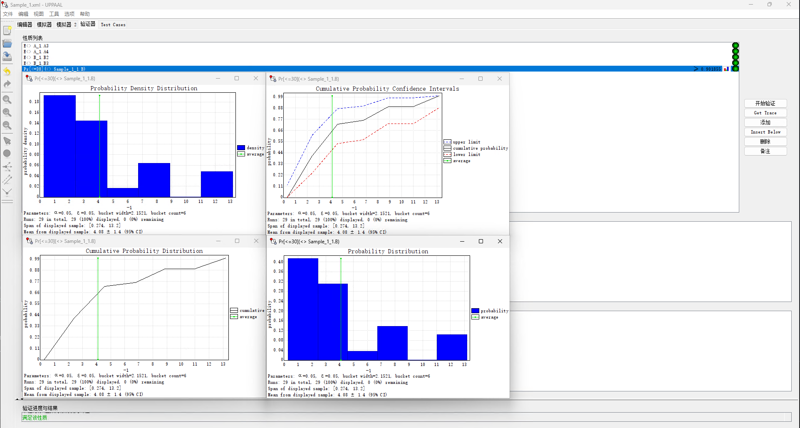

# stohMCharts

This is official implementation of **stohMCharts: A Modeling Framework for Quantitative Performance Evaluation of Cyber-Physical-Social Systems.**

## Requirements

To use stohMCharts, you'll need the following software installed on your system:
- Node.js version 19.4.0 or later.
- Uppaal version 4.0.15 or later.
 
## Deploy stohMCharts

To get started with stohMCharts, follow these steps:

1. Clone the code to your local machine by running the following command:

```bash
git clone git@github.com:beiyanpiki/stohMCharts.git --depth=1 && cd stohMCharts
```

2. Install the dependencies by running the following command. Make sure that `npm` is added to your PATH.

```bash
npm install
```

3. Build the application by running the following command:

```bash
npm run build
```

4. After the build process is complete, a new `build` folder will be generated. This folder contains the web application, which you can use in two ways:
    - You can use code server to run the web application on your local machine.
    - You can upload the `build` folder to your server to make the web application available to others.

## Sample

We've provided a simple example to show how to build and verify an SMC model using stohMCharts. Follow these steps to get started:

1. Build a composite model like the one shown in Figure 1. You can load our prepared model by clicking `Examples -> Case 1`.


2. Add some queries to verify our model. Click `Verification` and input the following queries (as shown in Figure 2):
> Please note that `system_name` = `template_name` + '_1'. For instance, the composite model `B`'s system_name is `B_1`, so you need use `B_1` in query's formula like `E<> B_1.B2` but not `E<> B.B2`

    - ``E<> A_1.A3``
    - ``E<> A_1.A4``
    - ``E<> B_1.B2``
    - ``E<> B_1.B3``
    - ``Pr[<=30](<> Sample_1_1.B)``



3. Click the `Export` button to get the Uppaal XML file(in this case, it's `Sample_1.xml`), you can open this file in Uppaal directly.

4. Finally, you can check the model with existing queries in two ways:
    - Use the [GUI verifier](https://docs.uppaal.org/gui-reference/verifier/) to check our queries and plot the results (as shown in Figure 3).
    
    - Use [Verifyta](https://docs.uppaal.org/toolsandapi/verifyta/) by running the following command to get a full log of the check, as shown in figure 4:
    ```bash
    .\verifyta.exe -t 0 .\Sample_1.xml -u -a 0.01 -E 0.05 -w 0.02 --histogram-bar-count 50  --state-representation 3  > out
    ```
    

## Cite

Please cite our [paper](https://ieeexplore.ieee.org/document/10114942) if you use this code in your own work:
```bibtex
@ARTICLE{10114942,
  author={An, Dongdong and Pan, Zongxu and Gao, Xin and Li, Shuang and Yin, Ling and Li, Tengfei},
  journal={IEEE Access}, 
  title={stohMCharts: A Modeling Framework for Quantitative Performance Evaluation of Cyber-Physical-Social Systems}, 
  year={2023},
  volume={},
  number={},
  pages={1-1},
  doi={10.1109/ACCESS.2023.3272672}
}
```
